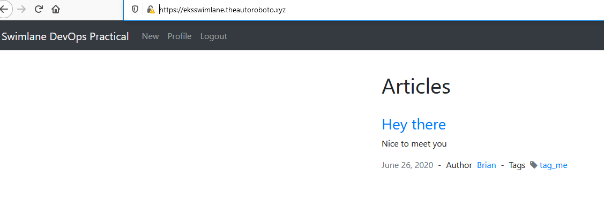

# devops-practical
For Swimlane

# dockerized application
	- /Dockerfile
	- docker hub location - mylucidreality/swimlane

# Expose on non-standard port
This one really stumped me.  I started a solution, but just could not get it to work.  I could make it work via HTTP on port 3000, but could not find a way to get the certificate terminated.  I was attempting the solution detailed here: https://kubernetes.github.io/ingress-nginx/user-guide/exposing-tcp-udp-services/

# Deploy mongodb
/application/mongo.yml <br>
Given additional time, I would need to learn hot to make the application authenticate to the mongodb.  Solution was started in /devops/mongo_user.yml

# kubernetes steps
Source in /application
## EKS
```
export AWS_SECRET_ACCESS_KEY=xxx
export AWS_ACCESS_KEY_ID=xxx
eksctl create cluster --region=us-east-2 --name swimlane --node-type=t2.micro --nodes 2 --ssh-access --ssh-public-key my-public-key.pub --managed
aws eks --region us-east-2 update-kubeconfig --name swimlane
k create ns ingress-nginx
k create ns swimlane
kubectl create secret tls tls-secret --key tls.key --cert tls.crt -n swimlane
k apply -f mongo.yml -n swimlane
k apply -f app.yml -n swimlane
k apply -f app-service.yml -n swimlane
k apply -f nginx.yml -n swimlane
```
## DigitalOcean
```
k --kubeconfig="/mnt/d/git/k8s-1-18-3-do-0-sfo2-1593106324392-kubeconfig.yaml" create ns ingress-nginx
k --kubeconfig="/mnt/d/git/k8s-1-18-3-do-0-sfo2-1593106324392-kubeconfig.yaml" create ns swimlane
k --kubeconfig="/mnt/d/git/k8s-1-18-3-do-0-sfo2-1593106324392-kubeconfig.yaml" create secret tls tls-secret --key tls.key --cert tls.crt -n swimlane
k --kubeconfig="/mnt/d/git/k8s-1-18-3-do-0-sfo2-1593106324392-kubeconfig.yaml" apply -f mongo.yml -n swimlane
k --kubeconfig="/mnt/d/git/k8s-1-18-3-do-0-sfo2-1593106324392-kubeconfig.yaml" apply -f app.yml -n swimlane
k --kubeconfig="/mnt/d/git/k8s-1-18-3-do-0-sfo2-1593106324392-kubeconfig.yaml" apply -f app-service.yml -n swimlane
k --kubeconfig="/mnt/d/git/k8s-1-18-3-do-0-sfo2-1593106324392-kubeconfig.yaml" apply -f digoceannginx.yml -n swimlane
```

# Packer/Ansible Build
Source in /packer


# completed
## DigitalOcean
https://digoceanswimlane.theautoroboto.xyz/

### kubernetes


## Amazon EKS
https://eksswimlane.theautoroboto.xyz/

### kubernetes
